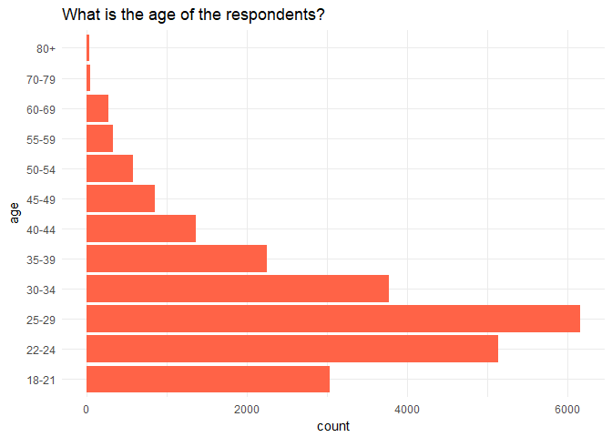

People in Surveys
================
Violeta Mezeklieva

This all started today when I saw a post on LinkedIn describing today’s
Data Scientist. The inforgraphic was produced by
[CloudFactory](https://www.cloudfactory.com/hubfs/02-Contents/5-Infographics/Life-of-Data-Scientist-Infographic.pdf?hsCtaTracking=4ed5fb6f-cb6d-4b5f-971e-3f69697204c2%7C77b4ec9b-262d-4ae4-bab3-8ac3be56a4f8),
complementing with their data on average salaries and job satisfaction
to the responses from a survey conducted by Kaggle in 2017.

I went off to find the data and found Kaggle repeated their survey in
[October 2018](https://www.kaggle.com/kaggle/kaggle-survey-2018),
capturing responses with an increase of 49% participants from last year.
So I took on to analyse this one since it has 23,859 participants to be
exact.

``` r
library("tidyverse")
```

``` r
multiple <- data.table::fread("multipleChoiceResponses.csv", skip = 1, colClasses = 'character')
```

``` r
cleaned_data <- multiple %>% rename(age = "What is your age (# years)?",
                            gender = "What is your gender? - Selected Choice",
                            country = "In which country do you currently reside?",
                            role = "Select the title most similar to your current role (or most recent title if retired): - Selected Choice",
                            industry = "In what industry is your current employer/contract (or your most recent employer if retired)? - Selected Choice",
                            years_experience = "How many years of experience do you have in your current role?",
                            salary = "What is your current yearly compensation (approximate $USD)?",
                            ml_at_work = "Does your current employer incorporate machine learning methods into their business?",
                            coding_time_work = "Approximately what percent of your time at work or school is spent actively coding?",
                            coding_in_past = "How long have you been writing code to analyze data?",
                            ml_in_past = "For how many years have you used machine learning methods (at work or in school)?",
                            self_proclaimed_ds = "Do you consider yourself to be a data scientist?")
```

I started cleaning the data so the column titles are shorter. Otherwise
I will have to use the entire sentence.

And began the analysis by focusing on the age of the respondents.

(If you checked the data by ths stage you’ll notice that not all columns
are included in ‘cleaned\_data’. The missing ones require more data
wrangling to see the multiple choices regarding the tools people use at
work. That is set aside for later. Stay tunned if you actually wanted to
read the update on CloudFactory’s infographic. It’s not going to be in
this post though).

``` r
cleaned_data %>% 
  ggplot() + geom_bar(aes(age), fill = 'tomato') + 
  ggtitle("What is the age of the respondents?") +
  coord_flip() + theme_minimal()
```

<!-- -->

What caught my eye, and this is not procrastination, is the respondents
who said their age is 80+. How many are there?

``` r
cleaned_data %>% filter(age == "80+") %>% count()
```

    ## # A tibble: 1 x 1
    ##       n
    ##   <int>
    ## 1    39

HA\! 39 respondents. I don’t doubt there are troopers out there. But
just to check, what do they say is their experience in their current
role?

``` r
cleaned_data %>% filter(age == "80+") %>%
  group_by(years_experience) %>% count() %>% arrange(desc(n))
```

    ## # A tibble: 10 x 2
    ## # Groups: years_experience [10]
    ##    years_experience     n
    ##    <chr>            <int>
    ##  1 ""                  13
    ##  2 30 +                 9
    ##  3 5-10                 5
    ##  4 0-1                  4
    ##  5 1-2                  2
    ##  6 2-3                  2
    ##  7 10-15                1
    ##  8 20-25                1
    ##  9 25-30                1
    ## 10 4-5                  1

9 say they have 30+ years of experience. 13 did not respond.

Alright, but about those career changers at age 79? That’s exciting\! I
guess it’s never too late.

What could be their reason? A better salary?

``` r
cleaned_data %>% filter(age == "80+", years_experience == '0-1') %>%
  group_by(salary, role) %>% count() 
```

    ## # A tibble: 4 x 3
    ## # Groups: salary, role [4]
    ##   salary                                                       role      n
    ##   <chr>                                                        <chr> <int>
    ## 1 0-10,000                                                     Other     1
    ## 2 500,000+                                                     Chie~     1
    ## 3 500,000+                                                     Other     1
    ## 4 I do not wish to disclose my approximate yearly compensation Data~     1

Woow\! More than 500k+ for a Chief Officer. Nice.

What about the respondents with 30+ of experience, what do they say is
their salary?

``` r
cleaned_data %>% filter(age == "80+", years_experience == '30 +') %>%
  group_by(salary, role) %>% count() 
```

    ## # A tibble: 8 x 3
    ## # Groups: salary, role [8]
    ##   salary      role                       n
    ##   <chr>       <chr>                  <int>
    ## 1 10-20,000   Principal Investigator     1
    ## 2 20-30,000   Consultant                 1
    ## 3 300-400,000 Software Engineer          1
    ## 4 500,000+    Chief Officer              1
    ## 5 500,000+    Other                      2
    ## 6 500,000+    Research Scientist         1
    ## 7 500,000+    Salesperson                1
    ## 8 80-90,000   Consultant                 1

Well, looks like becoming a Chief Officer is the dream\! You can change
your career at age 79 and earn the same as someone with 30+ years of
experience in that same role.

I feel bad for the Principal Investigators…Being 80+ years old, with 30+
years of experience, and earning 10-20K…But hey, everyone is entitled to
live their dream.

I dug deeper.

``` r
cleaned_data %>% filter(age == "80+" & gender == 'Female') %>%
  select(role, years_experience, country, salary)
```

    ##             role years_experience                  country salary
    ## 1 Data Scientist              2-3 United States of America

C’mon ladies…Let’s stop hiding our work. Not even in surveys\!
