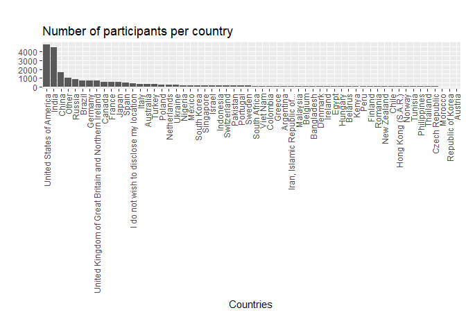

People in Surveys: Loudest Countries
================
Violeta

``` r
library("tidyverse")
```

``` r
cleaned_data <- data.table::fread("cleaned_data.csv")
```

### Intro

This is Part 2 of the series People in Surveys.

I am analysing data from a
[survey](https://www.kaggle.com/kaggle/kaggle-survey-2018#multipleChoiceResponses.csv)
conducted by Kaggle in October 2018, gathering data on the state of
Machine Learning and Data Science as viewed from their subscribers.

## The state of ML and Data Science in LatAm

What is the distribution of the participants?

``` r
cleaned_data %>% group_by(country) %>% count() %>% 
  ggplot(aes(reorder(country, -n), n)) + geom_col() +
  xlab("Countries") + ylab("") + ggtitle("Number of participants per country") +
  theme(aspect.ratio = 10/90) +
  theme(axis.text.x = element_text(angle = 90, vjust = 0.5, hjust=1))  
```

<!-- -->

The most active participants are people from the USA and
India

``` r
cleaned_data %>% filter(country %in% c('United States of America', "India")) %>% 
  group_by(country) %>% tally()
```

    ## # A tibble: 2 x 2
    ##   country                      n
    ##   <chr>                    <int>
    ## 1 India                     4417
    ## 2 United States of America  4716

``` r
4417/23859*100 + 4716/23859*100
```

    ## [1] 38.27906

Their participation is pretty much at pair. And together, they represent
38.28% of the voice in Data Science and ML in this survey.

If you are looking for further summary, here it is:

``` r
cleaned_data %>% group_by(country) %>% count() %>% summary()
```

    ##    country                n         
    ##  Length:58          Min.   :  62.0  
    ##  Class :character   1st Qu.:  86.5  
    ##  Mode  :character   Median : 151.0  
    ##                     Mean   : 411.4  
    ##                     3rd Qu.: 329.2  
    ##                     Max.   :4716.0

There is a 4386.8 difference between the 3rd quartile and the max value
(which is the USA, leading India with just 299 more participants). This
difference is almost as much as all the participants from India
combined\!

Their voice is more represented in this survey, and hence, these are the
people who are influencing the infographics and debates around the state
of Data Science and Machine Learning.

Should the rest of the world’s data scientist speak up? Do we differ? Do
we recognise our practices with those of India and the USA?

Stay tunned for more.
