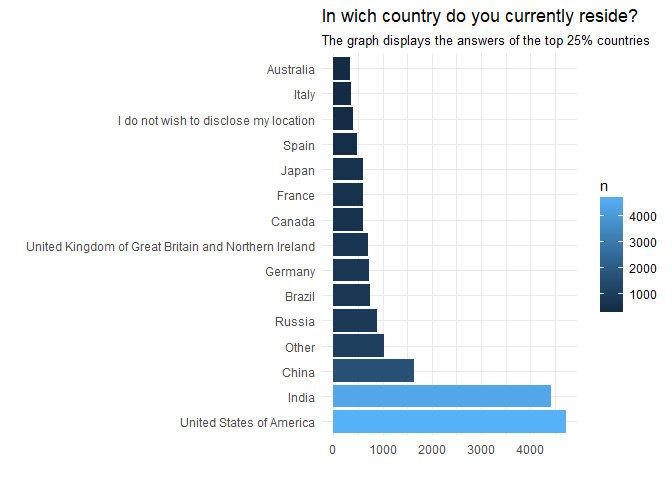
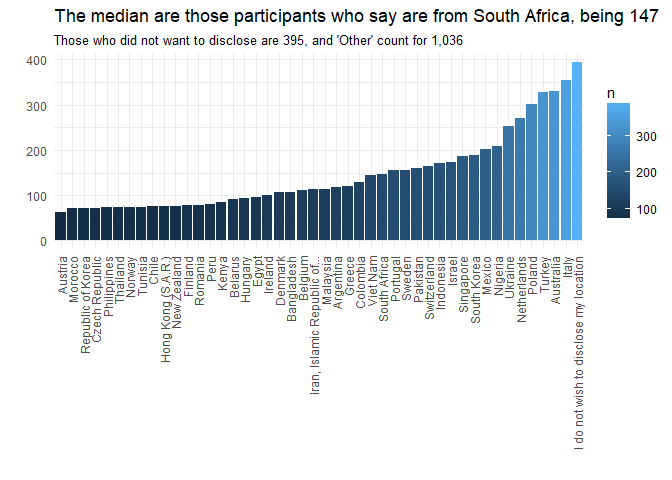
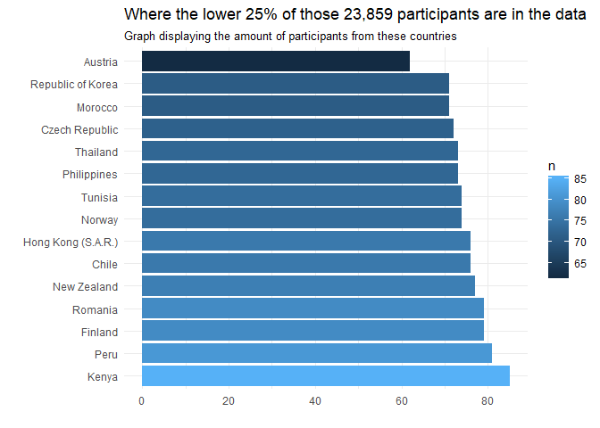
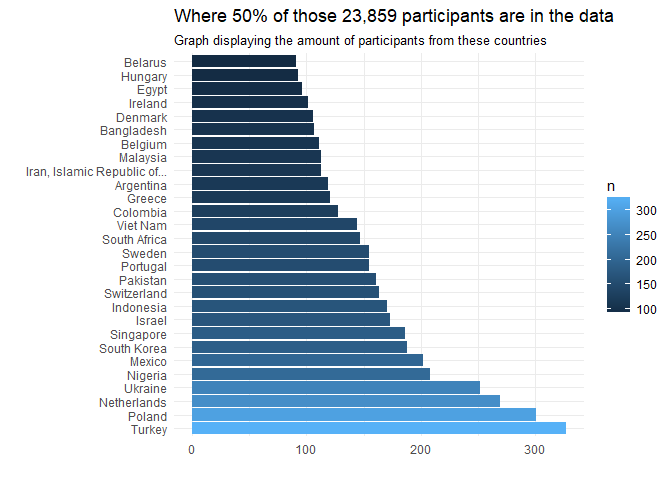

Silent Statements
================

``` r
library("tidyverse")
```

``` r
cleaned_data <- data.table::fread("cleaned_data.csv")
```

## Intro

This is part 2.1 of the series called People in Surveys.

I am analysing data from a
[survey](https://www.kaggle.com/kaggle/kaggle-survey-2018#multipleChoiceResponses.csv)
conducted by Kaggle in October 2018, gathering data on the state of
Machine Learning and Data Science as viewed from their subscribers.

In my earlier story I focused on the participants who said are currently
in India and China because together they account for 38.29% of the
people in this survey. That’s quite a lot, and with a big difference,
given the third top country is China with 1,644 participants.

But saying where you currently reside can be a funny thing to answer
given that for some of us, the question ‘Where do you currently reside’
is one thing. Which will be fine if the intention of the analysis is to
look at the state of Data Science and Machine Learning to learn more
about what each country is up to. However, if my location is compared to
my level of education, major..etc it can be mislading for those of us
who were born in one place, studied in two others, worked in a bunch of
others, and now reside elsewhere.

Then in a survey like this one, I will be inclined to chose “I wish not
to disclose my location”.  
Which is what some people answered in this survey.

Let’s see which countries are in the top 25% - the 3rd quartile.

``` r
cleaned_data %>% group_by(country) %>% count() %>% summary()
```

    ##    country                n         
    ##  Length:58          Min.   :  62.0  
    ##  Class :character   1st Qu.:  86.5  
    ##  Mode  :character   Median : 151.0  
    ##                     Mean   : 411.4  
    ##                     3rd Qu.: 329.2  
    ##                     Max.   :4716.0

``` r
cleaned_data %>% group_by(country) %>% count() %>% 
  filter(n > 329) %>% 
  ggplot(aes(reorder(country,-n) , n, fill = n)) + geom_col() + 
  ggtitle("In wich country do you currently reside?" ,subtitle = "The graph displays the answers of the top 25% countries") +
  xlab("") + ylab("") +
  coord_flip() + theme_minimal() 
```

<!-- -->

There are quite a lot of people who answered ‘Other’. Fair enough, there
are only 55 countries that were marked as an option in the survey from
[196](https://www.thoughtco.com/number-of-countries-in-the-world-1433445)
worldwide.

What stands out however, is the amount of people who wished not to
disclose their location. How many are
they?

``` r
cleaned_data %>% filter(country %in% c('Other', 'Wish not to disclose')) %>% group_by(country) %>% tally()
```

    ## # A tibble: 1 x 2
    ##   country     n
    ##   <chr>   <int>
    ## 1 Other    1036

It seems there is almost the same amount of people who answered
Australia and Italy to those who did not disclose. Let’s
see.

``` r
cleaned_data %>% filter(country %in% c("Australia", "Italy", "Wish not to disclose", "Spain")) %>% 
  group_by(country) %>% tally() %>% arrange((n))
```

    ## # A tibble: 3 x 2
    ##   country       n
    ##   <chr>     <int>
    ## 1 Australia   330
    ## 2 Italy       355
    ## 3 Spain       485

Yep, almost the same amout of people. Spain sets them apart from the
rest.

What is the participation from other locations with lesser participants
than those who did not disclose?

``` r
cleaned_data %>% group_by(country) %>% tally() %>%
  filter(n<395) %>%
  ggplot(aes(reorder(country, n), n, fill = n)) + geom_col() +
  ggtitle("The median are those participants who say are from South Africa, being 147", subtitle = "Those who did not want to disclose are 395, and 'Other' count for 1,036") + 
  xlab("") + ylab("") +
  theme_minimal() +
  theme(axis.text.x = element_text(angle = 90, vjust = 0.5, hjust=1)) 
```

<!-- -->
If we consider the median is with participants who are located in South
Africa, those who wish not to disclose are quite far ahead. They
represent 1.6% of the respondents.

I wonder if their reason is similar to mine…? And I also wonder how
honest are the others. Are people selecting the country where they are
born/affiliate instead?

I find this interesting. I’ll admit that sometimes I do not provide the
right information about where I am from, my gender, or even my age. This
is true particularly with services from which my interest is to listen
to music, read an article, or just peak in to understand what the
service is. My reasoning is because I do not want to receive targeted
marketing or information that is recommended to me based on the
similarities to those I am boxed with. And to be fair, most of the times
there is not an option to opt-out and still use the service.

I don’t always misinform, mainly because there most often are
alternatives that offer a similar thing. It’s just a matter of diggin it
out.

In this survey, Kaggle gave the option that allows participants to state
their disconfort when discloing their location The reasons I don’t know,
and it will be interesting to find out. Same as to see what countries
are people coming from for those who selected ‘Other’.

Are surveys always offering the same 55 countries? Why these? Austria
for example just had 66 respondents. I speculate when I say that
possibly there are at least other 66 people from this 1,036 who are from
the same country. I also speculate when I say that possibly, some people
opted for ‘Other’ instead of ‘I do not wish to disclose my location’ as
an automatic reaction to the option ‘Other’ in these forms.

Deeper zooming into participant distribution by country:

``` r
cleaned_data %>% group_by(country) %>% tally() %>% 
  filter(n < 86.5) %>% 
  ggplot(aes(reorder(country,-n) , n, fill = n)) + geom_col() + 
  ggtitle("Where the lower 25% of those 23,859 participants are in the data", subtitle = "Graph displaying the amount of participants from these countries") +
  xlab("") + ylab("") +
  coord_flip() + theme_minimal()
```

<!-- -->

``` r
cleaned_data %>% group_by(country) %>% tally() %>% 
  filter(n > 86.5 & n < 329.2)  %>% 
  ggplot(aes(reorder(country,-n) , n, fill = n)) + geom_col() + 
  ggtitle("Where 50% of those 23,859 participants are in the data", subtitle = "Graph displaying the amount of participants from these countries") +
  xlab("") + ylab("") +
  coord_flip() + theme_minimal()
```

<!-- -->

From those who chose not to disclose their location, did they also not
disclose something else about themselves?

``` r
cleaned_data %>% filter(country %in% "Wish not to disclose",
                        salary %in% "I do not wish to disclose my approximate yearly compensation") %>% tally()
```

    ##   n
    ## 1 0

``` r
cleaned_data %>% filter(country %in% "Wish not to disclose",
                        gender %in% c("Prefer not to say", "Prefer to self-describe")) %>% tally()
```

    ##   n
    ## 1 0

``` r
cleaned_data %>% filter(country %in% "Wish not to disclose",
                        salary %in% "I do not wish to disclose my approximate yearly compensation",
                        gender %in% c("Prefer not to say", "Prefer to self-describe")) %>% tally()
```

    ##   n
    ## 1 0

``` r
cleaned_data %>% filter(country %in% "Wish not to disclose",
                        role %in% 'Other') %>% tally()
```

    ##   n
    ## 1 0

``` r
cleaned_data %>% filter(country %in% 'Wish not to disclose',
                        gender %in% c("Prefer not to say", "Prefer to self-describe"),
                        role %in% 'Other') %>% tally()
```

    ##   n
    ## 1 0

``` r
cleaned_data %>% filter(country %in% "Wish not to disclose",
                        salary %in% "I do not wish to disclose my approximate yearly compensation",
                        gender %in% c("Prefer not to say", "Prefer to self-describe"),
                        role %in% 'Other') %>% tally()
```

    ##   n
    ## 1 0

``` r
cleaned_data %>% filter(country %in% "Wish not to disclose",
                        industry %in% 'Other') %>% tally()
```

    ##   n
    ## 1 0

``` r
cleaned_data %>% filter(country %in% "Wish not to disclose",
                        salary %in% "I do not wish to disclose my approximate yearly compensation",
                        industry %in% 'Other') %>% tally()
```

    ##   n
    ## 1 0

``` r
cleaned_data %>% filter(country %in% "Wish not to disclose",
                        salary %in% "I do not wish to disclose my approximate yearly compensation",
                        gender %in% c("Prefer not to say", "Prefer to self-describe"),
                        industry %in% 'Other') %>% tally()
```

    ##   n
    ## 1 0

What makes me curious is to imagine why do people participate in sueveys
in the first place? Participating should not mean to disclose everything
about oneself. But surely there can be ways to encourage participation
and sharing of data that is accurate.

Should the intentions of collecting data in the first place be more
clear? What about the communication of how data will be used? What
happens when data is made available for people like myself who find it,
and start making analysis that spark indivual interest?

When we live in an ear in which so much attention is given to those
whose data you have off, and dismiss the statements people make by
choosing not to participate…are can’t stop to think that we are missing
valuable perspectives by gving the loudest voices higher preferences.

ps. I did modify “United Kingdom of Great Britain and Northern Ireland”
to “UK and Northern Ireland” and “I do not with to disclose my location”
to “Wish not to disclose” to make the text fit in the graph.

Here is
how:

``` r
cleaned_data$country <- gsub("United Kingdom of Great Britain and Northern Ireland", "UK and Northern Ireland", cleaned_data$country)
cleaned_data$country <- gsub("I do not wish to disclose my location", "Wish not to disclose", cleaned_data$country)
```
